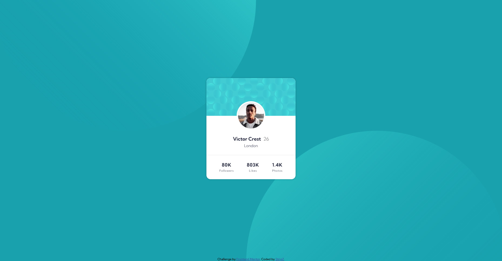

# Frontend Mentor - Profile card component solution

This is a solution to the [Profile card component challenge on Frontend Mentor](https://www.frontendmentor.io/challenges/profile-card-component-cfArpWshJ). Frontend Mentor challenges help you improve your coding skills by building realistic projects. 

## Table of contents

- [Overview](#overview)
  - [The challenge](#the-challenge)
  - [Screenshot](#screenshot)
  - [Links](#links)
- [My process](#my-process)
  - [Built with](#built-with)
  - [What I learned](#what-i-learned)
- [Author](#author)

## Overview

### The challenge

- Build out the project to the designs provided

### Screenshot



### Links

- Solution URL: [Link](https://www.frontendmentor.io/solutions/profile-card-component-with-css3-and-html5-54N3Yuinr)
- Live Site URL: [Link](https://strigz.github.io/Profile-card-component-challenge/)

## My process

### Built with

- Semantic HTML5 markup
- CSS custom properties
- Flexbox

### What I learned

Absolute positioning is pain...


```css
body::before {
    background-image: url(./images/bg-pattern-top.svg);
    float: left;
    margin-left: -100% !important;
    transform: translateY(-50%);
}

body::after {
    background-image: url(./images/bg-pattern-bottom.svg);
    float: right;
    margin-left: 100% !important;
    transform: translateY(50%);
}

body::after,
body::before {
    content: "";
    background-repeat: no-repeat;
    background-size: contain;
    background-position: center;
    position: absolute;
    top: 0;
    width: 100%;
    height: 100%;
    z-index: -55;
}
```
## Author

- Frontend Mentor - [@StrigZ](https://www.frontendmentor.io/profile/StrigZ)
